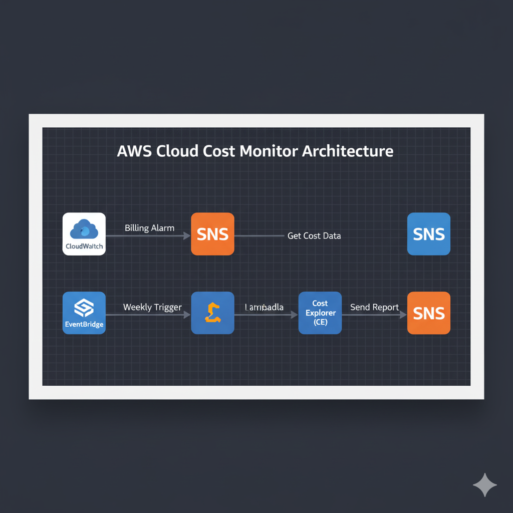
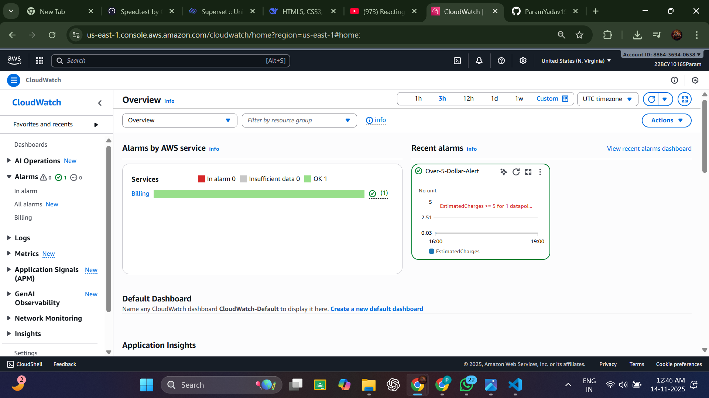
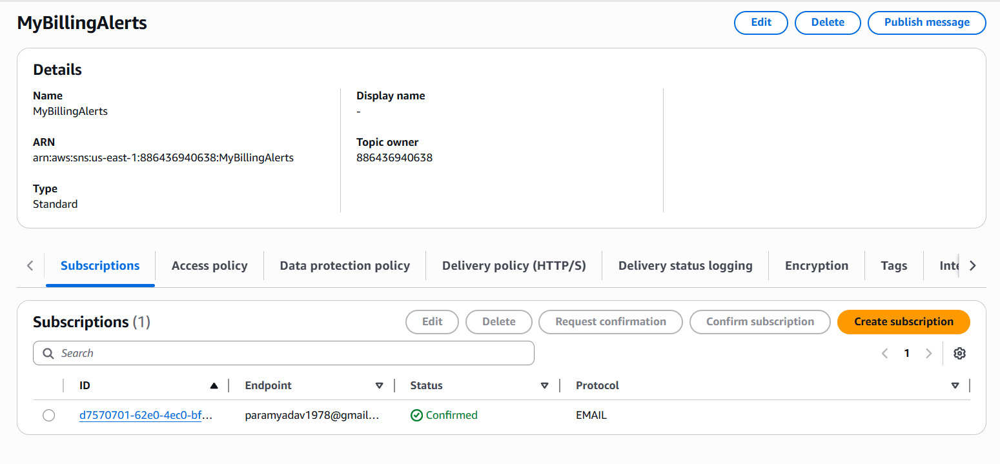

# AWS Cloud Cost Monitor Project

This project demonstrates a serverless architecture on AWS designed to monitor and report on cloud spending. It's built as a proof-of-concept for hands-on experience in core AWS services like CloudWatch, SNS, Lambda, and an understanding of the Cost Explorer API.

## Architecture

This project consists of two main functions, as shown in the architecture diagram:

1.  **Real-Time Billing Alert (Free & Active):** A CloudWatch Alarm monitors the account's total estimated charges. If the bill is projected to exceed a set threshold ($5), it triggers an SNS topic that sends an immediate email alert.
2.  **Weekly Spending Report (Demonstration):** An EventBridge rule (scheduler) would trigger a Lambda function on a weekly basis. The Lambda function (using Python) would then call the Cost Explorer API, generate a 7-day cost summary, and publish it to a separate SNS topic.

---

## Real-World Application & Problem Solved

In many organizations, unexpected cloud costs can quickly spiral out of control if not monitored proactively. This project directly addresses this by providing:

* **Immediate Anomaly Detection:** The CloudWatch Billing Alert acts as an early warning system. For instance, if a developer accidentally launches an expensive instance type or leaves a resource running overnight, this alert would notify stakeholders quickly, preventing significant cost overruns.
* **Proactive Cost Management:** The weekly report (demonstrated through code) enables teams to stay informed about their spending trends without manual effort. This allows for proactive budgeting, identifying areas of high expenditure, and optimizing resource usage before the end of the billing cycle.

Essentially, this solution helps cloud users and teams maintain financial control and avoid "bill shock" by automating critical cost monitoring tasks.

---

## Part 1: Real-Time Billing Alert (Implemented Proof)

This component is 100% free and has been actively configured in my AWS account as proof of hands-on ability.

### Screenshot 1: CloudWatch Billing Alarm
The alarm is configured to trigger if `EstimatedCharges` exceeds $5, ensuring immediate notification of potential overspending.

### Screenshot 2: SNS Subscription Confirmation
My email address is confirmed as a subscriber to the `MyBillingAlerts` SNS topic, ensuring alerts are received.

---

## Part 2: Weekly Spending Report (Demonstration Code)

This component is provided as a demonstration of my ability to write the necessary code and design the infrastructure for automated cost reporting. The Lambda function is **not** actively deployed to avoid incurring API costs ($0.01 per request) from the AWS Cost Explorer API.

### Lambda Function Code
The Python 3.10 code for the Lambda function, which fetches and formats cost data, is available in this repository:
[**`lambda_function.py`**](lambda_function.py)

### Required IAM Policy
The necessary IAM permissions policy for the Lambda function's execution role is also provided. This policy adheres to the principle of least privilege, granting only the required access for Cost Explorer API calls, SNS publishing, and CloudWatch logging.
[**`lambda-permissions.json`**](lambda-permissions.json)
